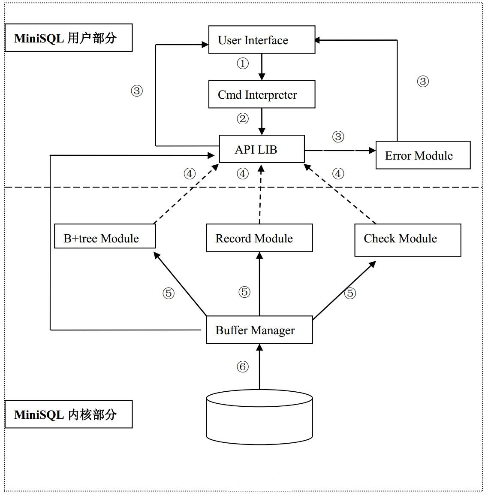

# MiniSQL 数据库系统详细设计报告

[TOC]

## 项目简介

- 项目名称：MiniSQL数据库系统设计与实现

- 主要目的：通过实验加深对DBMS及其内部实现技术的理解。实践系统软件开发的工程化方法。

- 编程语言：C/C++

- 开发方式：独立开发    自底向上模块化

- 运行平台：WIindow / Linux (可选) 

- 运行方式：单用户本地运行

- 依赖相关：

  - 底层文件及文件夹操作接口依赖于具体的操作系统，其他部分皆为标准C/C++语言实现。

    Linux平台下需要修改部分文件/文件夹操作接口函数

- 参考资料：

  - 项目借鉴：Zhejiang University 2001-2002 周等人MiniSQL项目。（本项目完全独立开发）
  -  B+树相关算法：
    - [B+树介绍](https://www.cnblogs.com/wade-luffy/p/6292784.html)
    - [B+树的几点总结](https://www.jianshu.com/p/6f68d3c118d6)
    -  [B树和B+树的插入、删除图文详解](https://www.cnblogs.com/nullzx/p/8729425.html)
    -  [从MySQL Bug#67718浅谈B+树索引的分裂优化](http://hedengcheng.com/?p=525)                                             


## 系统结构

### 系统结构图



**图中标号说明:**

1. 接收用户输入的字符串，并将输入传递给解释器；
2. 解释器用户的输入进行解析和语法检查，产生操作命令，并将命令传递给API模块；
3. API模块根据上层传递的命令数据，调用相关底层接口执行操作，输出命令执行结果并返回到用户界面；
4. B+tree、Record、Check类方法注册到APILIB，提供记录读写和类型检查；
5. B+tree、Record、Check类通过调用Buffer类实现对底层数据读写；
6. Buffer类方法对数据库文件进行直接读写操作；

### 系统目录结构

**/MiniSQL**

-  **/Src   -------------------------------------------------------------------------------  程序源码**

  - - /APILIB  ---------------------------------------------------------------------------  集成接口模块
  - - /BPLUSTREE  --------------------------------------------------------------------  B+树索引模块
  - - /BUFFER  -------------------------------------------------------------------------  Buffer模块
  - - /ERROR  ---------------------------------------------------------------------------  异常处理模块
  - - /GLOBAL  -------------------------------------------------------------------------  全局变量及数据结构定义
  - - /RECORD --------------------------------------------------------------------------  记录操作模块

- **/doc  --------------------------------------------------------------------------------  开发文档**

- **/bin  ---------------------------------------------------------------------------------  可执行文件**

- **ReadMe.md  ---------------------------------------------------------------------  项目指南**

  ​	

### 程序文件清单

|              | 模块名       | 程序文件名      | 运行平台     | 语言  | 简要描述           |
| ------------ | ------------ | --------------- | ------------ | ----- | ------------------ |
| **用户接口** | 解释器       | interpreter.h   | Window/Linux | C/C++ | 解释器模块头文件   |
|              | 解释器       | interpreter.cpp | Window/Linux | C/C++ | 解释器模块实现文件 |
|              | API接口      | APILIB.h        | Window/Linux | C/C++ | APILIB头文件       |
|              | API接口      | APILIB.cpp      | Window/Linux | C/C++ | APILIB实现文件     |
|              | 异常处理     | Error.h         | Window/Linux | C/C++ | 异常处理头文件     |
|              | 异常处理     | Error.cpp       | Window/Linux | C/C++ | 异常处理实现文件   |
| **系统内核** | B+树         | bptree.h        | Window/Linux | C/C++ | B+树头文件         |
|              | B+树         | bptree.cpp      | Window/Linux | C/C++ | B+树实现记录索引   |
|              | 记录模块     | Record.h        | Window/Linux | C/C++ | 记录模块头文件     |
|              | 记录模块     | Record.cpp      | Window/Linux | C/C++ | 记录模块实现文件   |
|              | 数据读写模块 | Buffer.h        | Window/Linux | C/C++ | Buffer头文件       |
|              | 数据读写模块 | Buffer.cpp      | Window/Linux | C/C++ | Buffer实现文件     |
|              | 检查模块     | check.h         | Window/Linux | C/C++ | 全局变量头文件     |
|              | 检查模块     | check.cpp       | Window/Linux | C/C++ | 全局变量实现文件   |
| **系统集成** | Global模块   | global.h        | Window/Linux | C/C++ | 全局变量头文件     |
|              | Global模块   | global.cpp      | Window/Linux | C/C++ | 全局变量实现文件   |
|              | 主程序       | MiniSQL.cpp     | Window/Linux | C/C++ | 主程序实现函数     |

​		

### 程序设计目标

#### 系统功能

设计并实现一个精简单用户SQL engine ，并在其中实现基本的数据库及表的操作功能。 其中：

- 表定义中的列(属性)至少支持三种数据类型：整型(int)、浮点型(double)、字符型数组(char array)
- 每张表必须有一个主键，且只有一个主键，单属性主键
- 实现数据库的创建/删除，实现表的创建/删除
- 实现记录的插入、删除、主键查找、非主键查找

#### 系统结构

- 模块化结构
- 内核部分B+、Record、Check三个模块分别实现建立索引、读写记录、安全检查功能，彼此分离不能相互调用；不能直接操作物理文件；由Buffer模块实现统一的物理文件读写功能
- 用户部分APILIB实现对底层的唯一接口调用；Error模块实现统一的异常处理功能；解释器(Interpreter)提供用户界面和系统的唯一交互接口
- 各个模块只向上负责

## 程序模块说明

**以下内容为程序关键部分简介，程序细节请参考源码以及注释**

### 主程序模块

1. 目标：负责系统运行，控制运行流程

2. 程序文件：MiniSQL.cpp

3. 调用其他模块：解释器模块

4. 主要数据结构及接口说明

   ```C++
   // 初始化系统
   void InitMiniSQL();
   
   // 运行系统
   // 负责读取用户命令输入并传递给解释器
   void RunMiniSQL();
   
   // 读取用户的输入命令
   std::string GetCommand();
   ```

### 解释器模块

1. 目标：翻译用户命令，生成命令封装数据，调用下层模块执行命令

2. 程序文件：interpreter.h    interpreter.cpp

3. 调用其他模块：APILIB模块

4. 主要数据结构及接口说明

   ```c++
   // 命令翻译类，负责翻译命令字符串，提取命令关键字
   // eg. create table tb_name(id int,score double) -> create table tb_name id int score double
   class SensefulStr;
   
   // 返回输入命令的操作类型,CmdType为定义在全局模块中的操作枚举类型
   CmdType GetOpType(std::vector<std::string> sen_str);
   
   // 生成封装好的数据库操作相关的命令结构体对象
   std::string ShowDbInfo(std::vector<std::string> sen_str);
   std::string CreateDbInfo(std::vector<std::string> sen_str);
   std::string DeleteDbInfo(std::vector<std::string> sen_str);
   std::string UseDbInfo(std::vector<std::string> sen_str);
   
   // 生成封装好的表操作相关的命令结构体对象
   bool CreateShowTableInfo(std::vector<std::string> sen_str);
   TB_Create_Info CreateTableInfo(std::vector<std::string> sen_str);
   TB_Insert_Info CreateInsertInfo(std::vector<std::string> sen_str);
   std::string DropTableInfo(std::vector<std::string> sen_str);
   TB_Select_Info TableSelectInfo(std::vector<std::string> sen_str);   //生成select操作所需的信息
   TB_Update_Info TableUpdateInfo(std::vector<std::string> sen_str);
   TB_Delete_Info TableDeleteInfo(std::vector<std::string> sen_str);
   
   // 结果显示类,可以重写该类以适应不同的用户界面（Cmd/GUI）
   class PrintWindow;
   ```

### APILIB模块

1. 目标：根据底层模块提供的接口，实现所有数据库的功能操作

2. 程序文件：APILIB.h    APILIB.cpp

3. 调用其他模块：Buffer模块    B+树模块    Record模块    Check模块

4. 主要数据结构及接口说明

   ```C++
   // 记录查找关系符,用于查找记录时条件语句的关系运算
   enum Operator_Type { B, BE, L, LE, E, NE };
   
   // 比较单元，将每一个查找/删除 条件分装成比较单元，用于查找符合条件的记录
   class CompareCell;  
   
   // 目录定位和切换，定位当前位置是否处于数据库中，用以检查数据库/表操作的合法性检查
   class CatalogPosition;
   
   /************************************************************************
   *    表创建信息
   ************************************************************************/
   struct TB_Create_Info
   {
   	using ColumnInfo = struct ColumnInfo               // 新建表的字段信息
   	{
   		std::string name;                              // 字段名称
   		Column_Type type;                              // 字段类型
   		bool isPrimary;                                // 是否主键
   		int length;                                    // 字段数据长度
   	};
   
   	std::string table_name;                            // 新建的表名
   	std::vector<ColumnInfo> columns_info;              // 表的各个字段
   
   };
   
   /************************************************************************
   *    表插入信息
   *    插入一条新记录，包括 字段-值 的数组，没有给定插入值的字段初始化为默认值
   ************************************************************************/
   struct TB_Insert_Info
   {
   	using InsertInfo = struct {
   		std::string column_name;                        // 插入的字段
   		std::string column_value;                       // 插入的值
   	};
   
   	std::string table_name;                             // 插入的表名
   	std::vector<InsertInfo> insert_info;                // 插入字段集合
   };
   
   /************************************************************************
   *    表记录选择(查找)信息
   ************************************************************************/
   struct TB_Select_Info
   {
   	std::string table_name;                            // 查找的表名
   	std::vector<std::string> name_selected_column;     // 查找的字段名字
   	std::vector<CompareCell> vec_cmp_cell;             // 查找条件
   };
   
   /************************************************************************
   *    表更新信息
   *    eg.
   *    NewValue = {name,china}
   *    expr = {id,>,20}
   *    操作结果:将id大于20的所有字段的 "name"字段的值全部改为"china"
   *    若expr为数组，则最终修改的记录为满足所有的expr数组元素条件
   ************************************************************************/
   struct TB_Update_Info
   {
       // 更新的字段名称以及新的值
   	using NewValue = struct {
   		std::string field;
   		std::string value;
   	};
       
       // 更新条件（要更新的记录满足的条件）
   	using Expr = struct {
   		std::string field;              // 条件的字段名称
   		std::string op;                 // 条件的字段运算关系
   		std::string value;              // 比较值
   	};
   
   	std::string table_name;
   	std::vector<NewValue> field_value;  // 字段——值 向量
   	std::vector<Expr> expr;             // 跟新的字段条件
   };
   
   /************************************************************************
   *    表删除信息
   ************************************************************************/
   struct TB_Delete_Info
   {
   	using Expr = struct {
   		std::string field;
   		std::string op;
   		std::string value;
   	};
   	std::string table_name;             // 删除目标的表名
   	std::vector<Expr> expr;             // 删除的字段条件
   };
   
   // 数据库操作，一个数据库对应一个文件夹
   // 数据库中的每张表对应数据库文件夹下的两个文件（索引文件.idx 和 数据文件.dbf）
   bool CreateDatabase(std::string database_name, CatalogPosition &cp);
   bool DropDatabase(std::string database_name, CatalogPosition &cp);
   bool UseDatabase(std::string db_name, CatalogPosition &cp);
   // 表的相关操作见源码以及注释
   ```

### 异常处理模块

1. 目标：输出异常信息并写入日志

2. 程序文件：Error.h Error.cpp

3. 调用其他模块：无

4. 主要数据结构及接口说明

   ```C++
   // 全局log日志
   extern std::fstream log_file;
   // 异常处理基类，实现异常显示和日志写入
   class BaseError
   {
       public:
       virtual void PrintError()const;
       virtual void WriteToLog()const;
       protected:
       std::string ErrorInfo;
       std::string ErrorPos;
   };
   ```

   

### Buffer模块

1. 目标：实现物理文件的读写，包括两类接口：

   - 一类实现对任意文件任意位置读写任意长度的数据
   - 另一类实现对固定长度数据的读写操作，并自动管理文件空间   

2. 程序文件：Buffer.h    Buffer.cpp

3. 调用其他模块：全局变量模块    异常处理模块

4. 功能：

   - 使其他模块与物理磁盘完全隔开，使之完全转换为内存操作
   - 提供系统缓冲， 模拟操作系统内存管理功能，加快数据文件的读取和写入

5. 接口实现：

   - 实现文件的创建和删除
   - 实现数据（记录）在文件中的读取和写入
   - 实现在文件中添加和删除数据时的空间自动管理
   - 提供对上层模块的统一接口

6. 工作原理：

   - 所有对于文件的读写都通过Buffer类提供的接口实现
   - Buffer类将磁盘文件以页的形式换入内存缓冲
   - 当待读写的文件数据所在的文件页之前已经被读入内存，则直接对该缓冲数据进行操作
   - 当待读写的文件数据所在的文件页不存在内存中 
     - 如果内存缓冲页未满，则将需要读写的文件页读入内存缓冲页，执行读写操作
     - 如果内存缓冲页已满，则通过内存页置换算法，将部分之前被使用的内存页写回到原文件，将待读写的文件页换入内存页

7. 文件格式：

   - 索引文件和数据文件有统一的文件格式 
   - 每个文件都以若干固定大小的文件页的形式存在
   - 除了零号页面，所有文件页都由**页头**和**数据区**两部分组成
   - 页头由**页号**和**常驻内存标志**组成。页号表示该页在文件中的位置，常驻内存标志用于内存页置换算法
   - 零号文件页除了页号和常驻内存标志外，还拥有**文件头信息数据区**，文件头信息记录了该文件可以写入新数据的位置信息，以及被删除的数据的位置信息。此外，还有一块预留区域保留以后使用

   

8. 内存缓存：磁盘文件的数据被读入内存缓冲区，通过内存缓冲读写文件数据。 

   

9. **数据保存格式 : **任意类型的数据通过buffer写入磁盘文件时，都将被转化为**写入地址+原始数据**的形式重新写入文件。 

   比如：当在文件**页号为12**，页内**偏移13**（byte）的位置写入**两个int(4byte)类型的数据10，14**的时候，实际写入的数据如下(小端机器): 

   | 文件内地址          | 数据（二进制值）                                   |
   | ------------------- | -------------------------------------------------- |
   | PageId:12 offset:13 | 00 00 00 0B\|00 00 00 0C\|0A 00 00 00\|0E 00 00 00 |

10. 主要数据结构及接口说明:

```c++
// 文件地址结构体，通过页号和页内偏移可以定位文件内的任意位置
/*********************************************************
*             文件地址,定位文件中的位置
**********************************************************/
class FileAddr
{
    ...
	unsigned long filePageID;     // 文件页编号
	unsigned int  offSet;         // 页内偏移量
	...
};

// 页头信息，标志该页在文件中的位置
/*********************************************************
*             页头信息，用以标识文件页
**********************************************************/
class PAGEHEAD
{
    ...
	unsigned long pageId;		// 页编号
	bool isFixed;				// 页是否常驻内存
    ...
};

// 文件头信息，记录该文件内的数据信息
/*********************************************************
*               文件头信息
**********************************************************/
class FILECOND
{
public:
	...
	FileAddr DelFirst;                         // 第一条被删除记录地址
	FileAddr DelLast;                          // 最后一条被删除记录地址  
	FileAddr NewInsert;                        // 文件末尾可插入新数据的地址
	unsigned long total_page;                  // 目前文件中共有页数
	char reserve[FILECOND_RESERVE_SPACE];      // 预留空间 
    ...
};


/*内存页类，每一个内存页都是某一文件的某一文件页在内存中的映射（缓冲），通过对内存页的读写，实现对磁盘文件的读写.同时内存页类记录着其对应的文件页自读入内存后的使用和读写操作，用以内存页置换算法。比如，某一文件 页调入内存后被改写过，则该内存页释放时候，需要先将该内存页内容写回到文件，否则就不需要写回直接释放。*/
/*********************************************************
*
*   名称：  内存页类
*   功能：  提供保存文件页的空间，以及该页相关的信息
*   不变式：内存页的大小固定
*
**********************************************************/
class MemPage
{
    ...
	void Back2File() const;            // 把内存中的页写回到文件中
	bool SetModified();                // 设置为脏页

public:
	unsigned long fileId;              // 文件指针，while fileId==0 时为被抛弃的页
	unsigned long filePageID;          // 文件页号

	mutable bool bIsLastUsed;          // 最近一次访问内存是否被使用，用于Clock算法
	mutable bool isModified;           // 是否脏页

	void *Ptr2PageBegin;               // 实际保存物理文件数据的地址
	PAGEHEAD *pageHead;                // 页头指针
	FILECOND* GetFileCond()const;      // 文件头指针（while filePageID == 0）
};

/*内存页管理类，管理内存页资源。将需要读写的文件页读入内存页缓冲，将不再需要使用的内存页在适当的时候释放（这里的释放并不是指释放内存空间，而是将不再使用的内存页标志为空闲（需要写回先写回）以待后续使用）。*/
/*********************************************************
*
*   名称：  内存页管理类（Clock页面置换算法）
*   功能：  物理页面在内存中的缓存，加速对物理文件的读写
*   不变式：调用者保证需要被载入的物理文件都存在，且加载的页面不越界
*
**********************************************************/
class Clock
{
	friend class MemFile;
	friend class BUFFER;
	friend class BTree;
public:
	Clock();
	~Clock();
#ifndef NDEBUG
	void PrintFileNameInMemory();   // 打印所有在内存中有缓存的文件页
#endif
private:
	// 返回磁盘文件内存地址
	MemPage* GetMemAddr(unsigned long fileId, unsigned long filePageID);

	// 创建新页，适用于创建新文件或者添加新页的情况下
	MemPage* CreatNewPage(unsigned long fileId, unsigned long filePageID);

private:
	// 返回一个可替换的内存页索引
	// 原页面内容该写回先写回
	unsigned int GetReplaceablePage();

	// 如果目标文件页存在内存缓存则返回其地址，否则返回 nullptr
	MemPage* GetExistedPage(unsigned long fileId, unsigned long filePageID);
	MemPage* LoadFromFile(unsigned long fileId, unsigned long filePageID);

	// Clock置换算法
	unsigned long ClockSwap();

	 
private:
	MemPage* MemPages[MEM_PAGEAMOUNT+1];  // 内存页对象数组
};

/*内存文件类，内存文件类的实例对应磁盘文件的映射，调用内存页置换算法类Clock，读写磁盘文件。*/
/*********************************************************
*   名称：  内存文件类
*   功能：  通过物理文件在内存中的映射文件的操作，从而操作物理文件
*   不变式：假设所有被操作的文件都存在且已经打开
*   记录格式: 记录地址+记录数据
**********************************************************/
class MemFile
{
	friend class BUFFER;
	friend class BTree;
public:
	const void* ReadRecord(FileAddr *address_delete)const;         // 读取某条记录,返回记录指针(包括记录地址数据)
	FileAddr AddRecord(void*source_record, size_t sz_record);                        // 返回记录所添加的位置
	FileAddr DeleteRecord(FileAddr *address_delete, size_t record_sz);               // 返回删除的位置
	
private:
	// 构造
	MemFile(const char *file_name, unsigned long file_id);
	// 写入数据
	void* MemRead(FileAddr *mem_to_read);                           // 读取内存文件,返回读取位置指针
	FileAddr MemWrite(const void* source, size_t length);           // 在可写入地址写入数据
	FileAddr MemWrite(const void* source, size_t length, FileAddr* dest);
	
	void MemWipe(void*source, size_t sz_wipe, FileAddr *fd_to_wipe);

	MemPage * AddExtraPage();                                       // 当前文件添加一页空间
	MemPage* GetFileFirstPage();                                    // 得到文件首页

private:
	char fileName[MAX_FILENAME_LEN];
	unsigned long fileId;                                          // 文件指针
	unsigned long total_page;                                      // 目前文件中共有页数
};


/*Buffer类，通过调用内存文件类，实现对所有磁盘文件的读写操作。*/
class BUFFER
{
public:
	BUFFER() = default;
	~BUFFER();
	MemFile* operator[](const char *fileName);      // 打开文件，打开失败返回 nullptr

	void CreateFile(const char *fileName);          // 创建文件，并格式化
	void CloseFile(const char *FileName);
	void CloseAllFile();	
private:
	// 返回文件所映射的内存文件
	MemFile* GetMemFile(const char *fileName);
private:
	std::vector<MemFile*> memFiles;  // 保存已经打开的文件列表
};
```


### B+tree 模块

1. 目标：通过B+树，创建和读写文件索引，提供数据库快速检索

2. 程序文件：bptree.h bptree.cpp

3. 调用其他模块：Buffer模块

4. 主要数据结构及接口说明

5. 接口实现

   - 创建和读写索引文件
   - 实现对关键字的查找、插入和删除操作
   - 打印B+树结点信息

6. 工作原理

   关于B+树的具体定义，目前还有一些细节上的分歧。在本项目的B+树的实现中，**B+树按照结点关键字个数和孩子结点个数一样多的定义实现**。即在一个结点中，有N个关键字，k[0], k[1], ..., k[N-1]，就对应着N个孩子结点child[0], child[1], ..., child[N-1]。其中，k[0] <= child[0] < k[1] <= child[1], ..., <key[N-1] <= child[N-1]。 

7. 主要数据结构及接口说明:

   ```C++
   // 索引文件头信息结点
   //MostLeftNode指向最左边的叶子结点，用于遍历数据和按照范围查找关键字。
   //RecordInfo记录了表中的一条记录的各个字段的类型和顺序。比如：
   /*
     RecordInfo数据	                            记录类型
     IFD	          一条记录三个字段，类型依次为：int,float,doouble
     IC10D	          一条记录三个字段，类型依次为：int, char, double。其中char字段为10个字符的字符串*/
   class IndexHeadNode
   {
   public:
   	FileAddr    root;                               // the address of the root
   	FileAddr    MostLeftNode;                       // the address of the most left node
   	char        KeyType;                            // 关键字类型
   	char        RecordInfo[RecordInfoLength];       // 记录字段相关信息
   };
   
   /* B+树的结点结构体。其中ROOT标志只在B+树的根结点关键字未满的情况下使用。在根节点分裂后，整个B+树只存在内结点和叶子结点两种类型。*/
   // define B+tree Node
   enum class NodeType {ROOT, INNER, LEAF};
   class BTNode
   {
   public:
   	NodeType node_type;                              // node type
   	int count_valid_key;                             // the number of key has stored in the node
   
   	KeyAttr key[MaxKeyCount];                        // array of keys
   	FileAddr children[MaxChildCount];                // if the node is not a leaf node, children store the children pointer
                                                        // otherwise it store record address;
   
   	FileAddr next;                                   // if leaf node
   	void PrintSelf();
   };
   
   // B+tree
   class BTree
   {
   public:
   	BTree(char *idx_name, char _KeyType = 'i', char *_RecordInfo="i");          // 创建索引文件的B+树
   	~BTree() { delete idx_name; }
   	FileAddr Search(KeyAttr search_key);                                        // 查找关键字是否已经存在
   	bool Insert(KeyAttr k, FileAddr k_fd);                                      // 插入关键字k
   	FileAddr Delete(KeyAttr k);                                                 // 返回该关键字记录在数据文件中的地址
   	void PrintBTreeStruct();                                                    // 层序打印所有结点信息
   	void PrintAllLeafNode();
   private:
   	FileAddr DeleteKeyAtInnerNode(FileAddr x, int i, KeyAttr key);              // x的下标为i的结点为叶子结点
   	FileAddr DeleteKeyAtLeafNode(FileAddr x, int i, KeyAttr key);               // x的下标为i的结点为叶子结点
   	void InsertNotFull(FileAddr x, KeyAttr k, FileAddr k_fd);
   	void SplitChild(FileAddr x, int i, FileAddr y);                             // 分裂x的孩子结点x.children[i] , y
   	FileAddr Search(KeyAttr search_key, FileAddr node_fd);                      // 判断关键字是否存在
   	FileAddr SearchInnerNode(KeyAttr search_key, FileAddr node_fd);             // 在内部节点查找
   	FileAddr SearchLeafNode(KeyAttr search_key, FileAddr node_fd);              // 在叶子结点查找
   	BTNode *FileAddrToMemPtr(FileAddr node_fd);                                 // 文件地址转换为内存指针
   	
   private:
   	char *idx_name;
   	int file_id;
   	IndexHeadNode idx_head;
   };
   ```

   

### Record模块

1. 目标：负责记录数据的读写

2. 程序文件：Record.h    Record.cpp

3. 调用其他模块：Buffer模块

4. 主要数据结构及接口说明

   ```C++
   /***********************************************************************************
   *
   *    定义记录各个字段的类型
   *    字段类型 I---int  C---字符串  D---Doouble
   *
   ***********************************************************************************/
   enum class Column_Type { I, C, D };
   
   /***********************************************************************************
   *
   *    联合的数据结构定义 字段的值
   *
   ***********************************************************************************/
   union Column_Value
   {
   	int   		        IntValue;		 //整形值
   	double 		        DoubleValue;     //浮点型值
   	char*               StrValue;	     //字符串指针 
   };
   
   /***********************************************************************************
   *
   *    定义索引文件关键字类型
   *
   ***********************************************************************************/
   class KeyAttr
   {
   public:
   	using Key_Value = union {
   		char                StrValue[ColumnNameLength];	     //字符串指针 
   		int   		        IntValue;		                //整形值
   		double 		        DoubleValue;                     //浮点型值	
   	};
   	Column_Type type;
   	Key_Value value;
   
   	bool operator<(const KeyAttr &rhs)const;
   	bool operator>(const KeyAttr &rhs)const;
   	bool operator==(const KeyAttr &rhs)const;
   	bool operator<=(const KeyAttr &rhs)const;
   	bool operator>=(const KeyAttr &rhs)const;
   	bool operator!=(const KeyAttr &rhs)const;
   
   };
   
   /***********************************************************************************
   *
   *    定义每个字段的单元数据
   *    字段单元记录了该字段的数据类型、数据的值、以及该字段的下一个字段指针
   *    注意拷贝和赋值操作
   *    如果保存的字段是字符串类型，则字符串的前三个字符表示表创建时定义好字符串长度
   ***********************************************************************************/
   
   class Column_Cell;
   
   /***********************************************************************************
   *
   *    定义一条记录的头结构，唯一标志一条记录
   *    记录的头记录了该记录的第一个字段的地址
   *    记录各个字段以链表的形式形成整条记录
   *    若是字符串类型字段，字符串前三个字符是表示该字段字符串的长度
   *
   ***********************************************************************************/
   class RecordHead
   {
   public:
   	RecordHead();
   	RecordHead(const RecordHead &rhs); // 拷贝构造
   	RecordHead& operator=(const RecordHead&rhs);  // 拷贝赋值
   	RecordHead(RecordHead &&rhs); // 移动构造
   	RecordHead& operator=(RecordHead&&rhs);  // 移动赋值
   	~RecordHead();
   
   	void AddColumnCell(const Column_Cell &cc);
   	size_t size()const;                         // 返回整条记录的大小
       Column_Cell* GetFirstColumn()const;
   	
   private:
   	Column_Cell *phead;  // 指向记录的第一个字段
   	Column_Cell *pLast;
   
   };
   
   /***********************************************************************************
   *
   *    记录类:  定义所有的记录数据操作。
   *    注意:    记录读写包括索引部分(.idx)和数据部分(.dbf)。
   *             索引部分的修改由B+树对应的模块负责
   *             本模块的所有操作只修改记录的实际数据部分。
   *
   *    说明：   本类所有的记录均以文件地址唯一标志。删除和查找记录的地址由索引树提供
   *
   ***********************************************************************************/
   class Record
   {
   public:
   	// 插入新的记录，返回新插入记录的所在数据文件的地址
   	FileAddr InsertRecord(const std::string dbf_name, const RecordHead &rd);
   
   	// 删除记录，返回删除的记录所在数据文件的地址
   	FileAddr DeleteRecord(const std::string dbf_name, FileAddr fd, size_t);
   
   	// 更新整条记录,若是字符串类型字段，字符串前三个字符是表示该字段字符串的长度
   	// 实际写入时并不将字符串的长度写进文件
   	bool UpdateRecord(const std::string dbf_name, const RecordHead &rd, FileAddr fd);   
   
   private:
   
   	// 将以链表的形式传入的记录数据读取并保存为一个整数据块以便于写入数据文件
   	// tuple的第一个元素为记录数据的大小，第二个元素为数据的指针
   	std::tuple<unsigned long, char*> GetRecordData(const RecordHead &rd);
   };
   ```

### Check模块

1. 目标：负责命令数据的检查

2. 程序文件：check.h    check.cpp

3. 调用其他模块：APILIB 模块

4. 主要数据结构及接口说明

   ```C++
   // 创建新表信息检查
   void Check_TB_Create_Info(const TB_Create_Info &tb_create_info);
   
   // 表插入信息检查
   void Check_TB_Insert_Info(const TB_Insert_Info &tb_insert_info);
   
   // 表更新信息检查
   void Check_TB_Update_Info(const TB_Update_Info &tb_update_info);
   
   // 删除信息检查
   void Check_TB_Delete_Info(const TB_Delete_Info &tb_delete_info);
   
   // 查找信息检查
   void Check_TB_Select_Info(const TB_Select_Info &tb_select_info);
   ```

   

## 软件模块的物理分布

除数据文件在磁盘上外，其他都在内存中操作。

## 接口设计

对外提供的接口：

- 数据库创建
- 数据库删除
- 表的创建
- 表的删除
- 插入记录
- 删除记录
- 更新记录

## 数据加密处理

暂无

## 版本信息

- 2018/07/07      Beta1.0